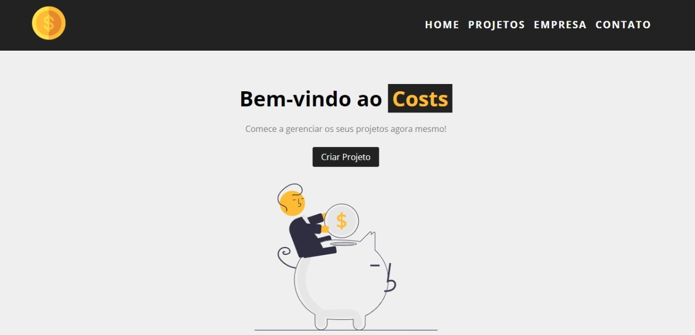

# Gerenciador de projetos 
## Projeto de estudos na parte de React.Js.

 
 

---

---
## 🌟 Tecnologias 

Projeto foi desenvolvido com as seguintes tecnologias

- [Javascript](https://developer.mozilla.org/pt-BR/)
- [Node](https://nodejs.org/en/)
- [React.Js](https://pt-br.reactjs.org/)
- [json-server](https://www.npmjs.com/package/json-server)
- [react-icons](https://react-icons.github.io/react-icons/)
- [react-router-dom](https://reactrouter.com/web/guides/quick-start)

---
## Como executar:

- Clone o repositório
- Instale o [npm](https://docs.npmjs.com/downloading-and-installing-node-js-and-npm)
- instale as dependências com `npm install` no terminal
- Inicie o servidor com `npm start` no terminal
- Acesse o  `localhost:3000` do seu navegador
- inicie o backend com `npm run backend`no terminal para simular o backend 

---

criado por Anderson Jorge,  em Novembro de 2021.
